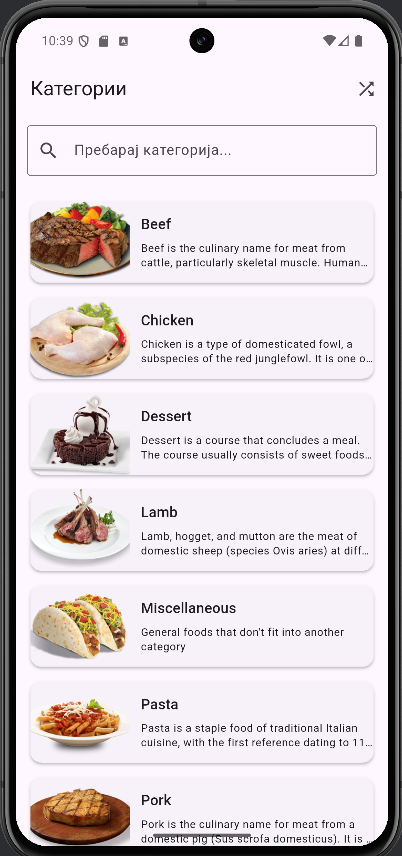
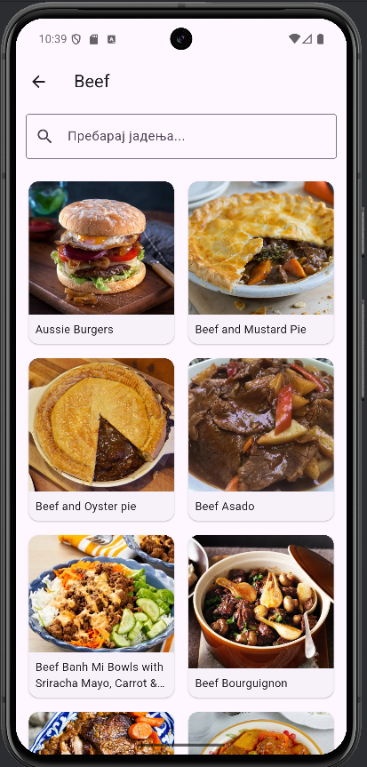
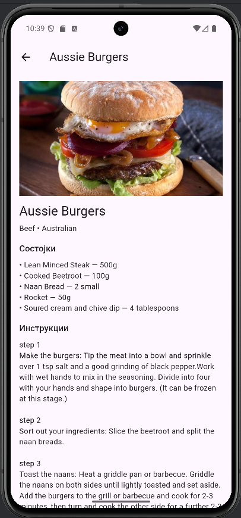
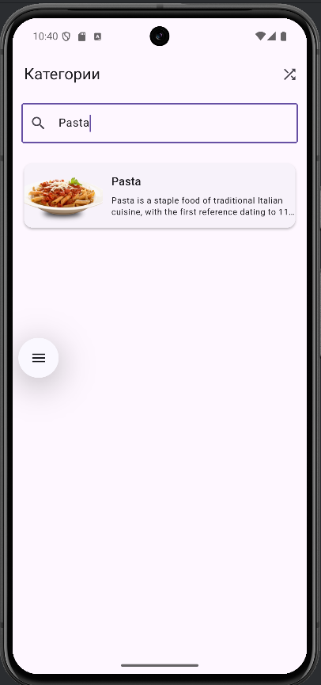

# 🍽️ MealApp — Преглед на рецепти

Flutter апликација за прикажување на **рецепти и јадења** со користење на **TheMealDB API**, организирани по категории.  
Апликацијата овозможува лесно прегледување на категории, јадења, детали за секој рецепт и случаен рецепт на денот.

---

## 📱 Функционалности

### 1. Почетен екран — *Листа на категории*
- Прикажува **список на сите категории на јадења** во формат на **картички (Cards)**.
- Секоја категорија содржи:
    - Име на категорија
    - Слика (thumbnail)
    - Краток опис
- Можност за **пребарување на категории** преку `TextField`.
- При клик на категорија се отвора нов екран со сите јадења од таа категорија.
- Во **AppBar** има икона за **рандом рецепт на денот**.

---

### 2. Екран со јадења по категорија — *Grid приказ*
- По избор на категорија се прикажуваат **сите јадења** од таа категорија.
- Јадењата се прикажани во **Grid Layout** (2 колони), секое со:
    - Слика
    - Име на јадењето
- Можност за **пребарување** на јадења во рамките на таа категорија.
- При клик на јадење се отвора деталниот приказ на рецептот.

---

### 3. Детален приказ на рецепт — *Екран со сите детали*
- При клик на јадење се отвора екран со **детален приказ на рецептот**.
- Прикажани информации:
    - Име на јадењето
    - Категорија и потекло (област)
    - Слика
    - Листа на состојки со мерки
    - Детални инструкции за подготовка
    - YouTube линк (доколку постои)
- Дизајнот е прегледен, со едноставен Material 3 стил и Scrollable Layout.

---

### 4. Рандом рецепт на денот
- Во AppBar на почетниот екран има копче за вчитување **рандом рецепт** преку API повик.
- Прикажува целосен рецепт со сите детали, како и во деталниот приказ.

---

## Користени API ендпоинти

| Функција | Endpoint |
|-----------|-----------|
| Листа на категории | `https://www.themealdb.com/api/json/v1/1/categories.php` |
| Јадења по категорија | `https://www.themealdb.com/api/json/v1/1/filter.php?c={category}` |
| Детален рецепт | `https://www.themealdb.com/api/json/v1/1/lookup.php?i={id}` |
| Рандом рецепт | `https://www.themealdb.com/api/json/v1/1/random.php` |
| Пребарување по име (опционално) | `https://www.themealdb.com/api/json/v1/1/search.php?s={query}` |

---

## Структура на проектот

```
lib/
│
├── models/
│ ├── category.dart 
│ ├── meal.dart 
│ └── meal_detail.dart
│
├── services/
│ └── api_service.dart 
│
├── screens/
│ ├── categories_screen.dart 
│ ├── meals_by_category_screen.dart 
│ └── meal_detail_screen.dart 
│
├── widgets/
│ ├── category_card.dart 
│ └── meal_card.dart 
│
└── main.dart
```


---

### Визуелни карактеристики

- Material 3 дизајн (useMaterial3: true)
- Card Layout со Rounded Corners и InkWell ефект при клик. 
- Pull-to-refresh на категориите. 
- Cached слики со CachedNetworkImage и loading indicator. 
- Search полиња за филтрирање на категории и јадења. 
- Прегледен и едноставен UI.

---

## 📸 Screenshots






---

### Автор

- Име и презиме: Никола Сарафимов
- Број на индекс: 223091
- Предмет: Мобилни информациски системи
- Година: 2025/26